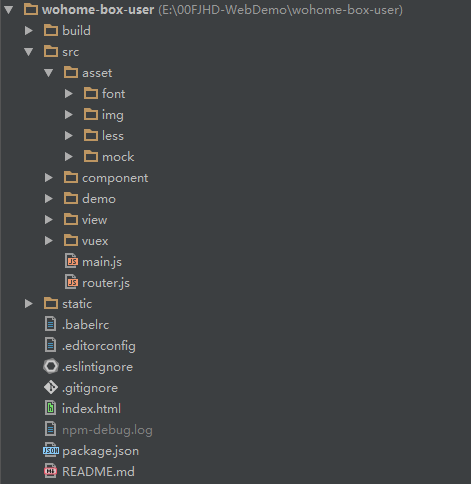

# 代码规范
    该文档主要目标是使项目开发的编码风格保持一致，方便理解与管理。

## 目录结构规范

- 项目目录组织示例

    

- 命名：不使用复数，使用常用简写形式

```
 build：构建配置
 static：静态资源
 src: 源文件目录。 不允许使用source等。
 － component：组件
 － demo：示例
 － view：页面
 － vuex: vuex文件
 － asset：资源
 －－ font：字体文件
 －－ img: 图片。 不允许使用image、images、imgs等
 －－ css: 样式表。 不允许使用style、styles等。
 －－ js: javascript脚本。 不允许使用script、scripts等。
 －－ dep: 引入的第三方依赖包目录。 不允许使用lib、library、dependency等。
 －－ mock：模拟数据
 
```

## 文件命名规范
    
- 用-分割。不使用 _ 与驼峰格式 

        对：home-page.html
        错：home_page.html homePage.html
    
## HTML规范
   
- 所有标签名用小写

- 所有属性用双引号“”
    
- id与属性的命名一律小写，单词用 - 分割。

        对：id="person-list"、class="person-content"
        错：id="PersonList"、id="person_list"

-  样式引入放在head中，脚本引入放在body的底部

        <head>
            <link rel="stylesheet" href="/static/type.css">
        </head>
        <body>
            <!-- a lot of elements -->
            <script src="init-behavior.js"></script>
        </body>

- 对于无需自闭合的标签，不允许自闭合，常见无需自闭合标签有 input、br、img、hr 等
        
        对：<inut>
        错：<input />

- button 标签必须指明type属性
        
        对：<button type="submit">提交</button>，<button type="button">取消</button>
        错：<button>取消</button>

- 标签嵌套规则：块元素可以包含内联元素或某些块元素，但内联元素却不能包含块元素,它只能包含其它的内联元素。

        对：<div><span></span></div>
        错：<span><div></div></span>

- h1、h2、h3、h4、h5、h6、p、dt这几个特殊的块级标签不能再包含块级标签
        
        错：<h1><div></div></h1>

- 附：块级元素
        
        address、blockquote、center、dir、div、dl、dt、dd、
        fieldset、form、h1~h6、hr、isindex、menu、noframes，
        noscripts、ol、p、pre、table、ul

- 附：内嵌元素
        
        a、abbr、acronym、b、bdo、big、br、cite、code、dfn、em、font、
        i、img、input、kbd、label、q、s、samp、select、small、span、
        strike、strong、sub、sup、textarea、tt、u、var

## CSS规范

- class命名小写 ，单词用 - 分割
    
- class命名要根据内容命名，不允许用颜色值标签等类型来命名
       
        对：class=“header-bg”
        错：class=“red”，class=“span"

- 颜色使用#rrggbb格式，避免使用rgb()表达式
        
        对：color: #fefefe;
        错：color: rgb(254, 254, 254);

- 同个css文件里，公用的样式写在前面

- 最小字体到12px，不能再小，12px以下的在chrome会被当做12px

## JS规范

- 所有的string用单引号‘’。使之与html的双引号区别

        对：var name = 'Zhang';
        错：var name＝ “Zhang”;

- 尽量减少全局变量，

- 变量就近声明，避免在函数或其它形式的代码块起始位置统一声明所有变量

- 变量命名采用驼峰格式
        
        对：var myTest=‘测试’

- 每个 var 只能声明一个变量

        对：
        var hangModules = [];
        var missModules = [];
        var visited = {};
    
        错：
        var hangModules = [],
        missModules = [],
        visited = {};

- 常量用全大写命名
        
        对：const PI=‘3.14’
    
- 所有数组的命名后缀+List。如：对：personList 错：persons

- js文件头部要加注释

        /**
         * Author : yourName.
         * Date   : ${DATE}.
         * File   : ${NAME}.
         */
```

- 简单函数直接用//注释，普通函数注释如下：

        /**
         * 函数描述
         * @param {type} 参数1的说明
         * @param {String} 参数2的说明
         * @param {Function} 参数3的说明
         * @return {Boolean} 参数4的说明
         */

- 类注释

        /**
         * 类描述
         * @class MyClass
         * @extends Parent
         */

- 细节注释 对于内部实现、不容易理解的逻辑说明、摘要信息等要编写细节注释

        function foo(p1, p2, opt_p3) {
          // 这里对具体内部逻辑进行说明,注释要新起一行
          // 说明太长需要换行
          for (...) {
            ....
          }
        }

附：js的编码规则与技巧较多，建议查阅：
> https://github.com/ecomfe/spec/blob/master/javascript-style-guide.md


#### 参考
>  https://github.com/ecomfe/spec.git